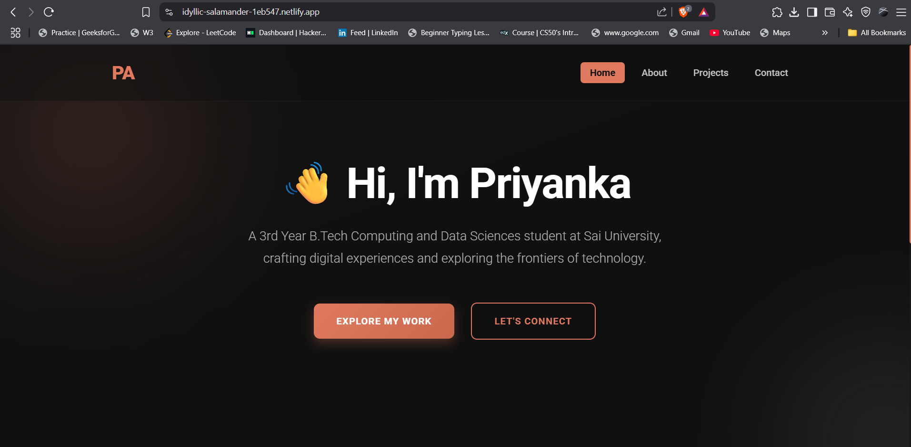
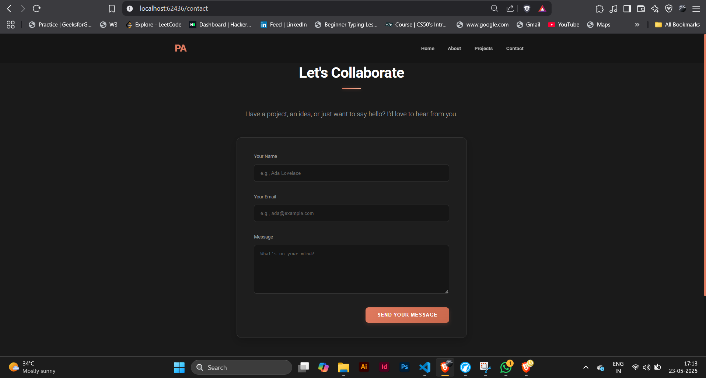
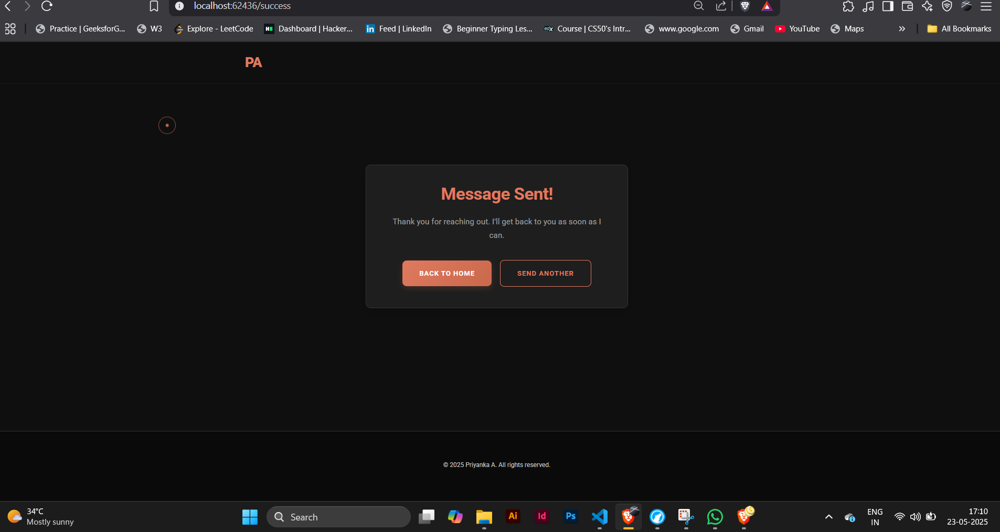
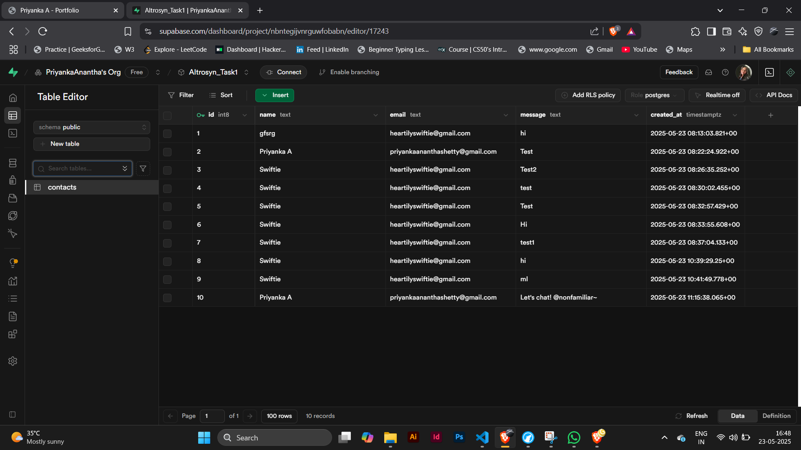

# A Portfolio Website (Task 1)

A personal portfolio website built with vanilla HTML, CSS, and JavaScript, featuring a working contact form connected to a Supabase backend. Developed as part of the Altrosyn Internship day 1 task.

**[Live Demo](https://idyllic-salamander-1eb547.netlify.app/)** 

## ✨ Key Features

*   Responsive multi-page design (Home, About, Projects, Contact)
*   Modern dark theme with a Terracotta accent color scheme
*   Custom circular transparent cursor with interactive hover states
*   Fully functional hamburger menu for mobile navigation
*   Subtle entrance animations and hover effects using CSS & vanilla JavaScript
*   Advanced CSS: Gradient borders, pulsing CTAs, glassmorphism navbar
*   Profile picture integration
*   Working contact form (Node.js backend, Supabase DB)
*   Built purely with HTML5, CSS3, and Vanilla JavaScript (ES6+)

## 📸 Screenshots

](Desktop view)

 
*(Homepage - Desktop View)*



*(Contacts page)*



*(Successful form submission)*


*(Mobile Navigation)*



*(Working Supabase database intergration.)*


## 🛠️ Tech Stack

*   **Frontend:** HTML5, CSS3, Vanilla JavaScript (ES6+)
*   **Backend:** Node.js, Express.js
*   **Database:** Supabase (using PostgreSQL)
*   **Version Control:** Git, GitHub

## 🚀 Running Locally

### Prerequisites
*   Node.js (v18+ recommended) and npm installed.
*   A Supabase project set up with a table named `contacts` (columns: `id`, `name`, `email`, `message`, `created_at`).

### Backend Setup
1.  Clone the repository:
    ```bash
    git clone https://github.com/PriyankaAnantha/Altrosyn-Internship.git
    ```
2.  Navigate to the project directory:
    ```bash
    cd Altrosyn-Internship
    ```
3.  Install backend dependencies:
    ```bash
    npm install
    ```
4.  Ensure your Supabase URL and Service Role Key in `server.js` are correct for your project.
5.  Start the backend server:
    ```bash
    node server.js
    ```
    The backend will typically run on `http://localhost:3000`.

### Frontend Setup
1.  In a separate terminal, navigate to the project directory (`Altrosyn-Internship`).
2.  Use a static file server. For example, using the `serve` package:
    *   If not installed globally: `npm install -g serve`
    *   Run: `serve -l 5500` (or your preferred port)
3.  Open your browser and navigate to `http://localhost:5500`.


## 👤 Author

**Priyanka A**
*   GitHub: [@PriyankaAnantha](https://github.com/PriyankaAnantha)
*   LinkedIn: [Priyanka Anantha (linkedin.com/in/priyanka-anantha/)](https://www.linkedin.com/in/priyanka-anantha/) 
---